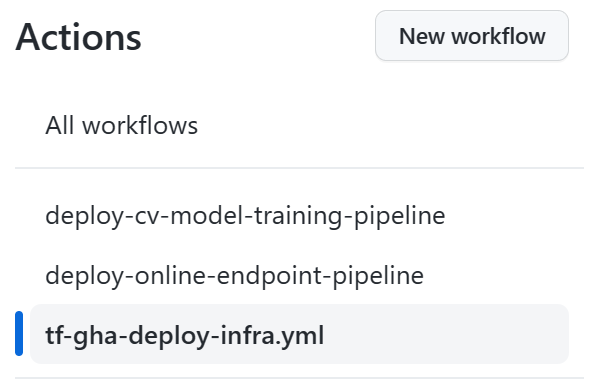

# MLOps V2 Computer Vision Quickstart

This repository is a prebuilt project demonstrating a computer vision MLOps scenario using Azure Machine Learning and GitHub workflows.


This project was generated using the [MLOps v2 Solution Accelerator](https://github.com/Azure/mlops-v2) using the following project generation parameters:

| Parameter  | Value |  
| --- | --- |
| Project Type: | cv |  
| Interface: | aml-cli-v2 |  
| CICD Orchestration| github-actions |  
| IAC Provider | terraform |

Below is a quickstart to deploying this prebuilt project. Refer to the [MLOps v2 Solution Accelerator](https://github.com/Azure/mlops-v2) project for more comprehensive documentation and deployment guides for generating your own MLOps projects.

## Steps to Deploy

Clone this repository to your own GitHub organization and follow the steps below to deploy the demo.

1. [Create an Azure Service Principal and configure GitHub actions secrets.](#configure-github-actions-secrets)
2. [Configure dev and/or prod environments and create a dev branch.](#configure-azure-ml-environment-parameters)
3. Execute workflow to create Azure ML infrastructure for dev and/or prod environments.
4. Execute workflow to create and execute a pytorch vision model training pipeline in Azure ML.
5. Execute workflow to deploy the vision model as a real-time endpoint in Azure ML.  


## Configure GitHub Actions Secrets

   This step creates a service principal and GitHub secrets to allow the GitHub action workflows to create and interact with Azure Machine Learning Workspace resources.

      From the command line, execute the following Azure CLI command with your choice of a service principal name:
      > `# az ad sp create-for-rbac --name <service_principal_name> --role contributor --scopes /subscriptions/<subscription_id> --sdk-auth`

      You will get output similar to below:

      >`{`  
      > `"clientId": "<service principal client id>",`  
      > `"clientSecret": "<service principal client secret>",`  
      > `"subscriptionId": "<Azure subscription id>",`  
      > `"tenantId": "<Azure tenant id>",`  
      > `"activeDirectoryEndpointUrl": "https://login.microsoftonline.com",`  
      > `"resourceManagerEndpointUrl": "https://management.azure.com/",`  
      > `"activeDirectoryGraphResourceId": "https://graph.windows.net/",`  
      > `"sqlManagementEndpointUrl": "https://management.core.windows.net:8443/",`  
      > `"galleryEndpointUrl": "https://gallery.azure.com/",`  
      > `"managementEndpointUrl": "https://management.core.windows.net/"`  
      > `}`

      Copy all of this output, braces included.

      From your GitHub project, select **Settings**:

      

      Then select **Secrets**, then **Actions**:

      

      Select **New repository secret**. Name this secret **AZURE_CREDENTIALS** and paste the service principal output as the content of the secret.  Select **Add secret**.

      > **Note:**  
      > As this infrastructure is deployed using terraform, add the following additional GitHub secrets using the corresponding values from the service principal output as the content of the secret:  
      > 
      > **ARM_CLIENT_ID**  
      > **ARM_CLIENT_SECRET**  
      > **ARM_SUBSCRIPTION_ID**  
      > **ARM_TENANT_ID**  

      The GitHub configuration is complete.

## Configure Azure ML Environment Parameters

   In your Github project repository, there are two configuration files in the root, `config-infra-dev.yml` and `config-infra-prod.yml`. These files are used to define and deploy Dev and Prod Azure Machine Learning environments. With the default deployment, `config-infra-prod.yml` will be used when working with the main branch or your project and `config-infra-dev.yml` will be used when working with any non-main branch.

   It is recommended to first create a dev branch from main and deploy this environment first.

   Edit each file to configure a namespace, postfix string, Azure location, and environment for deploying your Dev and Prod Azure ML environments. Default values and settings in the files are show below:

   > ```bash
   > namespace: mlopsv2 #maximum of 6 characters.  
   > postfix: 0001  
   > location: eastus  
   > environment: dev  
   > enable_aml_computecluster: true  
   > enable_monitoring: false  
   >```
   
   The first four values are used to create globally unique names for your Azure environment and contained resources. Edit these values to your liking then save, commit, push, or pr to update these files in the project repository. Leave `enable_monitoring` set to `false` for this demo. 

   As this is a deep learning workload, ensure your subscription and Azure location has available GPU compute. 
      
 ## Deploy Azure Machine Learning Infrastructure

   In your GitHub project repository, select **Actions**

   

   This will display the pre-defined GitHub workflows associated with your project. For a classical machine learning project, the available workflows will look similar to this:

   

   Depending on the the use case, available workflows may vary. Select the workflow to 'deploy-infra'. In this scenario, the workflow to select would be **tf-gha-deploy-infra.yml**. This would deploy the Azure ML infrastructure using GitHub Actions and Terraform.

   

   On the right side of the page, select **Run workflow** and select the branch to run the workflow on. This may deploy Dev Infrastructure if you've created a dev branch or Prod infrastructure if deploying from main. Monitor the pipeline for successful completion.

   

   When the pipeline has complete successfully, you can find your Azure ML Workspace and associated resources by logging in to the Azure Portal.

   Next, a model training pipeline and scoring endpoint will be deployed into the new Azure Machine Learning environment.


## Contributing

This project welcomes contributions and suggestions.  Most contributions require you to agree to a
Contributor License Agreement (CLA) declaring that you have the right to, and actually do, grant us
the rights to use your contribution. For details, visit https://cla.opensource.microsoft.com.

When you submit a pull request, a CLA bot will automatically determine whether you need to provide
a CLA and decorate the PR appropriately (e.g., status check, comment). Simply follow the instructions
provided by the bot. You will only need to do this once across all repos using our CLA.

This project has adopted the [Microsoft Open Source Code of Conduct](https://opensource.microsoft.com/codeofconduct/).
For more information see the [Code of Conduct FAQ](https://opensource.microsoft.com/codeofconduct/faq/) or
contact [opencode@microsoft.com](mailto:opencode@microsoft.com) with any additional questions or comments.

## Trademarks

This project may contain trademarks or logos for projects, products, or services. Authorized use of Microsoft 
trademarks or logos is subject to and must follow 
[Microsoft's Trademark & Brand Guidelines](https://www.microsoft.com/en-us/legal/intellectualproperty/trademarks/usage/general).
Use of Microsoft trademarks or logos in modified versions of this project must not cause confusion or imply Microsoft sponsorship.
Any use of third-party trademarks or logos are subject to those third-party's policies.
